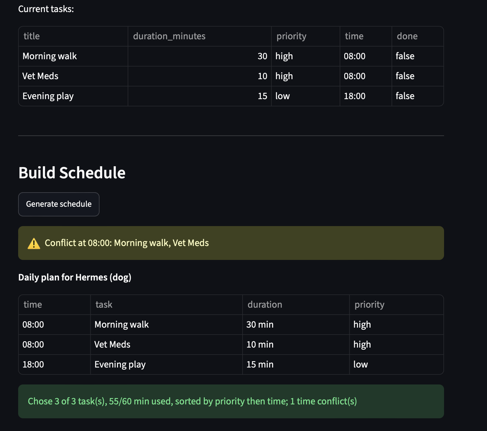

# PawPal+ (Module 2 Project)

**PawPal+** is a Streamlit app that helps a pet owner plan daily care tasks for their pet. A user enters owner and pet info, adds tasks (with duration and priority), and the app generates a prioritized daily plan that fits within a time budget — and explains its reasoning.

## Scenario

A busy pet owner needs help staying consistent with pet care. They want an assistant that can:

- Track pet care tasks (walks, feeding, meds, enrichment, grooming, etc.)
- Consider constraints (time available, priority, owner preferences)
- Produce a daily plan and explain why it chose that plan

The system is designed first as a UML diagram, then implemented as a Python logic layer (`pawpal_system.py`), verified with a CLI demo and tests, and finally connected to the Streamlit UI (`app.py`).

## Architecture

- **`pawpal_system.py`** — the logic layer. Four classes: `Task`, `Pet`, `Owner`, and `Scheduler` (the "brain").
- **`main.py`** — a CLI demo that exercises the logic layer without the UI.
- **`app.py`** — the Streamlit UI, wired to the logic layer via `st.session_state`.
- **`tests/test_pawpal.py`** — the pytest suite.
- **`diagrams/`** — UML source (`uml.mmd`, `uml_final.mmd`).

## Getting started

### Setup

```bash
python -m venv .venv
source .venv/bin/activate  # Windows: .venv\Scripts\activate
pip install -r requirements.txt
```

### Run the app

```bash
streamlit run app.py
```

### Run the CLI demo

```bash
python main.py
```

## 🖥️ Sample Output

```
Today's Schedule for Markian (budget: 120 min)
================================================

Biscuit (Golden Retriever):
  08:00  Morning walk    (30 min) [priority: high] [todo]
  09:00  Feeding         (10 min) [priority: high] [todo]

Milo (Cat):
  10:00  Litter change   (5 min) [priority: med] [todo]
  17:00  Playtime        (15 min) [priority: low] [todo]
```

## 🧪 Testing PawPal+

```bash
# Run the full test suite:
pytest
```

The suite covers core behavior (task completion, task counting) and the scheduling algorithms (priority+time sorting, time-budget filtering, conflict detection, daily recurrence) plus edge cases (empty task list, zero budget, non-recurring tasks).

Sample test output:

```
============================================================ test session starts ============================================================
platform darwin -- Python 3.12.5, pytest-9.1.1, pluggy-1.6.0 -- /Library/Frameworks/Python.framework/Versions/3.12/bin/python3
cachedir: .pytest_cache
rootdir: /Users/markianzab/Desktop/ai110-module2show-pawpal-starter
plugins: anyio-4.13.0
collected 9 items

tests/test_pawpal.py::test_mark_complete_changes_status PASSED           [ 11%]
tests/test_pawpal.py::test_add_task_increases_count PASSED               [ 22%]
tests/test_pawpal.py::test_sort_by_priority_then_time PASSED             [ 33%]
tests/test_pawpal.py::test_filter_defers_tasks_over_budget PASSED        [ 44%]
tests/test_pawpal.py::test_detect_conflicts_flags_same_time PASSED       [ 55%]
tests/test_pawpal.py::test_recurrence_generates_next_day PASSED          [ 66%]
tests/test_pawpal.py::test_once_task_does_not_recur PASSED               [ 77%]
tests/test_pawpal.py::test_pet_with_no_tasks_produces_empty_plan PASSED  [ 88%]
tests/test_pawpal.py::test_zero_budget_keeps_nothing PASSED              [100%]

============================================================= 9 passed in 0.01s =============================================================
```

**Confidence level:** ⭐⭐⭐⭐ (4/5) — all core scheduling behaviors are verified. Next I'd add duration-aware overlap detection and multi-pet UI tests.

## 📐 Smarter Scheduling

| Feature | Method(s) | Notes |
|---------|-----------|-------|
| Task sorting | `Scheduler.sort_by_priority()` | Priority first (high→med→low), then clock time |
| Filtering | `Scheduler.filter_by_time_budget()` | Greedy: keeps highest-priority tasks that fit the minute budget |
| Conflict handling | `Scheduler.detect_conflicts()` | Warns (doesn't crash) when two tasks share a clock time |
| Recurring tasks | `Scheduler.advance_recurring()` | Daily/weekly tasks regenerate for the next date via `timedelta` |

## 📸 Demo Walkthrough

**Main UI features and actions the user can perform:**

- Enter owner name and a daily time budget (in minutes).
- Enter pet name and species.
- Add tasks with a description, duration, priority (high/med/low), and optional time.
- View all current tasks in a table.
- Click **Generate schedule** to produce a prioritized daily plan with reasoning.

**Example workflow:**

1. Set the owner name and a time budget (e.g. 120 minutes).
2. Enter the pet's name and species.
3. Add a few tasks — e.g. a high-priority "Morning walk" (30 min, 08:00), a high-priority "Feeding" (10 min, 09:00), and a low-priority "Evening play" (15 min).
4. The task table updates as each task is added.
5. Click **Generate schedule** to see the plan, sorted by priority then time, with a reasoning line explaining what was chosen and why.

**Key Scheduler behaviors shown:**

- **Sorting** — tasks appear high → med → low regardless of the order they were entered.
- **Time-budget filtering** — if the tasks exceed the budget, lower-priority ones are deferred.
- **Conflict warnings** — two tasks at the same clock time are flagged.
- **Reasoning** — the plan explains how many tasks were chosen, how much of the budget was used, and how many were deferred or in conflict.

**Sample CLI output (`python main.py`):**

```
--- All tasks, sorted by priority then time ---
  08:00  Morning walk   [high] (30 min)
  08:00  Vet meds       [high] (10 min)
  09:00  Feeding        [med] (10 min)
  18:00  Evening play   [low] (15 min)

--- Conflicts ---
  ⚠️  Conflict at 08:00: Morning walk, Vet meds

--- Today's plan (within 60 min budget) ---
  08:00  Morning walk   [high] (30 min)
  08:00  Vet meds       [high] (10 min)
  09:00  Feeding        [med] (10 min)

  Reasoning: Chose 3 of 4 task(s), 50/60 min used, sorted by priority then time; 1 deferred (over budget); 1 time conflict(s)

--- Recurrence demo ---
  Completed 2026-07-08; next occurrence generated for 2026-07-09
```

**Screenshot**: 